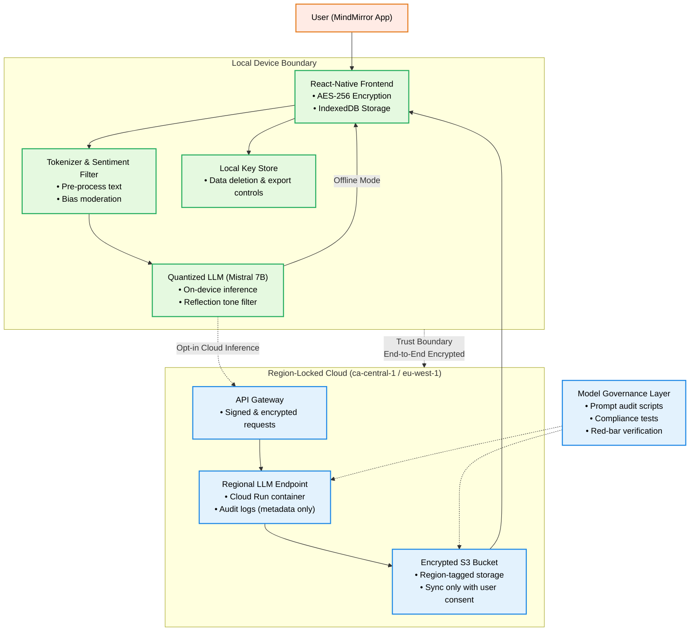

# Capstone Pitch Report - **MindMirror: A Privacy-Preserving Mental Health Companion**

## 1. Core Pitch Idea

**Problem:**
Most AI wellness apps (e.g., Replika, Wysa) collect deeply personal reflections and store them on U.S. servers, exposing users to data resale, surveillance, and opaque model behavior. This violates local data-protection norms like **PIPEDA**, **GDPR**, and **LGPD**, undermining user trust and autonomy.

**Proposed Solution:**
*MindMirror* is a **decentralized AI wellness chatbot** that processes all conversations **locally or in region-locked clouds**. It blends **mindfulness and Daoist reflection** to encourage calm, culturally inclusive self-inquiry without exporting sensitive data.
The app transparently signals when AI is used, encrypts all messages end-to-end, and allows users to delete or export data at will.

**Monetization / Impact Model:**
Freemium subscription:

* **Free:** Local inference, journaling, daily reflection mode
* **Premium:** Encrypted cloud sync, streak tracking, and personalized summaries
  Impact goal: Demonstrate that emotional AI can be both private and ethically grounded.

## 2. Problem & Stakeholders
**Scenario Summary:**
Digital wellness tools increasingly cross jurisdictions without respecting **data protection** laws. Under **PIPEDA (Canada)** and **GDPR (EU)**, emotional data may be considered sensitive personal information depending on context—particularly if it relates to health conditions or uses biometric processing. Both frameworks require appropriate consent and safeguards for international data transfers.

**Primary Stakeholders:**

* Everyday users seeking safe reflective tools
* Mental-health practitioners exploring digital adjuncts
* Regulators ensuring cross-border compliance

**Empty Chair:**
Users uncomfortable with Western mental-health framings—such as **culturally diverse or spiritually oriented populations**—who desire reflective dialogue without clinical or data-extractive overtones.

**Pain Points:**

* Lack of visibility into where data goes
* Distrust of AI tone or bias
* Need for calm, private reflection rather than “therapy replacement”

## 3. Architecture Snapshot

**Trade-offs:**

| Factor          | Decision                          | Rationale                         |
| --------------- | --------------------------------- | --------------------------------- |
| **Cost**        | Local inference increases compute | Prioritizes user sovereignty      |
| **Ethics**      | Region isolation + explainability | Aligns with privacy and fairness  |
| **Reliability** | Offline fallback                  | Works even without network access |

## 4. Clause → Control → Test
| Clause (Promise) | Control (Implementation) | Test (Red Bar) |
| --- | --- | --- |
| Example: "Canadian health data stays in Canada." | Route 53 resolver in ca-central-1 + IAM policy restricting analysts to Canadian VPC | `test_canada_data_residency()` asserts no non-CA buckets referenced |
| Clause 1 | | |
| Clause 2 | | |

## 5. AI / Automation Usage Plan
- How you will use GenAI / automation tools
- Known failure modes + mitigation plan
- Documentation strategy (what will you publish?)

## 6. Risks & Mitigations
- Risk 1 (ethical, operational, cost, etc.) + mitigation + evidence/test
- Risk 2 + mitigation + evidence/test
- Success metrics / acceptance tests (tie back to Clause→Control→Test)

## Appendix (Optional)
- Supporting data (links to repo, ledger entry, etc.)
- Assumptions & open questions