# MindMirror: Privacy-Preserving Companion

## 1. Core Pitch Idea
**Problem:** Most AI wellness apps (e.g., Replika, Wysa) collect deeply personal reflections and store them on U.S. servers, exposing users to data resale, surveillance, and opaque model behavior. This violates local data-protection norms like **PIPEDA**, **GDPR**, and **LGPD**, undermining user trust and autonomy.

**Proposed Solution:** MindMirror, a decentralized, ethical AI chatbot that processes conversations locally or in region-locked clouds. It uses mindfulness and Daoist reflection for culturally inclusive self-inquiry without exporting sensitive data. The app transparently signals when AI is used, encrypts all messages end-to-end, and allows users to delete or export data at will.

**Monetization / Impact Model:** Freemium subscription (Free: Local inference/journaling; Premium: Encrypted cloud sync/summaries).

## 2. Problem & Stakeholders
**Scenario Summary:**
Digital wellness tools increasingly cross jurisdictions without respecting data protection laws. Under **PIPEDA (Canada)** and **GDPR (EU)**, emotional data may be considered sensitive personal information depending on context—particularly if it relates to health conditions or uses biometric processing. Both frameworks require appropriate consent and safeguards for international data transfers.

**Primary Stakeholders:**
The main stakeholders are users seeking safe reflective spaces, mental-health practitioners exploring digital adjuncts, and regulators monitoring compliance.

**Empty Chair:**
Users uncomfortable with Western mental-health framings—such as **culturally diverse or spiritually oriented populations**—who desire reflective dialogue without data-extractive overtones.

**Pain Points:**
Common pain points include uncertainty over where data goes, distrust of AI tone or bias, and the desire for calm, private reflection that functions even offline.

## 3. Architecture Snapshot & Trade-offs

| Factor          | Decision                          | Rationale                         |
| --------------- | --------------------------------- | --------------------------------- |
| **Cost**        | Local inference increases compute | Prioritizes user sovereignty      |
| **Ethics**      | Region isolation + explainability | Aligns with privacy and fairness  |
| **Reliability** | Offline fallback                  | Works even without network access |

## 4. Clause → Control → Test
| Clause (Promise)                                                 | Control (Implementation)                                           | Test (Red Bar)                                                              |
| ---------------------------------------------------------------- | ------------------------------------------------------------------ | --------------------------------------------------------------------------- |
| 1. “User reflections never leave their jurisdiction.”            | VPC isolation + region-tagged S3 bucket (ca-central-1 / eu-west-1) | `test_region_lock()` asserts all writes reference correct regional endpoint |
| 2. “AI responses are always disclosed and logged transparently.” | UI badge + metadata tag (`source: AI`) + audit ledger              | `test_ai_disclosure()` checks every chat entry includes `source` metadata   |
| 3. “User data remains deletable and exportable.”                 | Local key-store + GDPR “Right to be Forgotten” API                 | `test_data_erasure()` deletes all user rows and verifies null return        |

## 5. AI / Automation Usage Plan
The quantized **Mistral 7B** model supports on-device inference, while **nightly prompt-audit scripts** test tone, compliance, and latency. **GPT-4 assists in code refactoring** and documentation but never accesses user data.

**Failure Modes & Mitigation:**
To mitigate failures, sentiment and toxicity filters prevent *harmful or hallucinatory responses*, a *culturally balanced* reflective corpus (Daoist, Stoic, Indigenous texts) reduces bias, and *automated regression tests* track model drift.

**Documentation Strategy:**
Public **Model Card** + **Data Flow Diagram** outlining privacy guarantees, red-bar test results, and known limitations.

## 6. Risks & Mitigations
| Risk                                                        | Mitigation                                                  | Evidence / Test                              |
| ----------------------------------------------------------- | ----------------------------------------------------------- | -------------------------------------------- |
| **Ethical:** Model gives harmful or prescriptive advice     | Fine-tune for reflection (not diagnosis) + moderation layer | Sentiment audit < 1% harmful responses       |
| **Operational:** Local inference drains battery             | Quantized model (GGUF 8-bit) + usage cap                    | Battery-profiling test < 10% drain / session |
| **Compliance:** Data inadvertently stored in foreign region | Region-lock control + nightly red-bar test                  | `test_region_lock()` passes 100% of runs     |

**Success Metrics:**
Success metrics target a **95% transparency-trust score**, **≤ 1% failed jurisdictional compliance tests**, and **< 10% power-consumption overhead** during local inference.

## Appendix (Optional)
- Assumptions: regional compute available; user consents to encrypted journaling.
- GDPR Chapter 2, Article 9: *“Processing of special categories of personal data”* 
  [https://gdpr-info.eu/art-9-gdpr/](https://gdpr-info.eu/art-9-gdpr/)
- PIPEDA: *"Guidelines for processing personal data across borders"*
  [https://www.priv.gc.ca/en/privacy-topics/airports-and-borders/gl_dab_090127/](https://www.priv.gc.ca/en/privacy-topics/airports-and-borders/gl_dab_090127/)