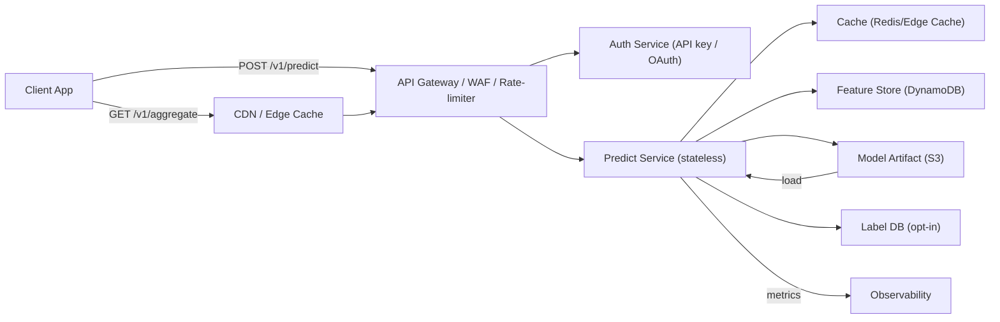

# Architectural Diagram and Minimal Evaluation Plan — *CatchChance*

*(For Minimal Evaluation Plan, please also see Sections 4, 5, and 10 of `Project_Sepc.md` for full detail. This file restates essentials for rubric compliance.)*

---

## Architectural Diagram

## Baseline vs. Model Plan

* **Baseline (defensible, immediate):**
  Hour × grid historical catch rate with Laplace smoothing (α=10), computed over 90 days.
  → Cheap DB query; fits within free-tier.

* **Simple Model (candidate):**
  Logistic regression (or small GBT) predicting `caught_any` with features: user-level catch rate, hour, environment, location grid.
  → Lightweight, interpretable, low-cost inference.

---

## Metrics & SLA

* **Primary metrics:**

  * **AUC-PR** (handles imbalanced positives).
  * **Calibration** (Brier score / calibration curve).
  * We care more about well-calibrated probabilities (so users can make rational decisions).

* **Secondary metrics:**

  * p95 latency
  * Error rate
  * Cache hit rate
  * Cost per 10k predictions

* **SLA targets:**

  * p95 latency ≤ **300 ms** for personalized predictions.
  * **99.5% availability** of health endpoints.
  * Cost envelope:

    * Normal load (100 req/day) stays in free tier.
    * Max budget ≤ **\$1 per 10k predictions** at scale.
  * **Graceful degradation** under burst (50k req/hr).

**Rationale:** a 300 ms p95 keeps UX snappy on mobile; lightweight model inference and caching should make this achievable.

---

## Measurement Plan
**Offline evaluation (minimum):**

- **Data:** historic sessions (user_id hashed, grid, hour, features, label).
- **Split:** time-based train/validation/test (train through date T; validate on T to T+30d; test on next 30d) to avoid leakage.
- **Baseline:** compute baseline hourly-grid rates and measure AUC-PR and Brier score on test set.
- **Model:** train logistic regression, evaluate same metrics. Acceptance: **AUC-PR improvement ≥ 0.05 over baseline** OR **Brier score improved by ≥ 5%** and p95 latency under 300 ms in inference bench.

**SLA measurement plan:**

- Create synthetic load tests:
    - **Normal load:** 100 req/day (no issues) — confirm bill < free tier.
    - **Spike test:** 50k req/hour (burst) with mix of cached vs. personalized calls. Verify degradation behavior and circuit breaker triggers. Measure p95 for cached responses and for model responses until circuit-breaker trips.