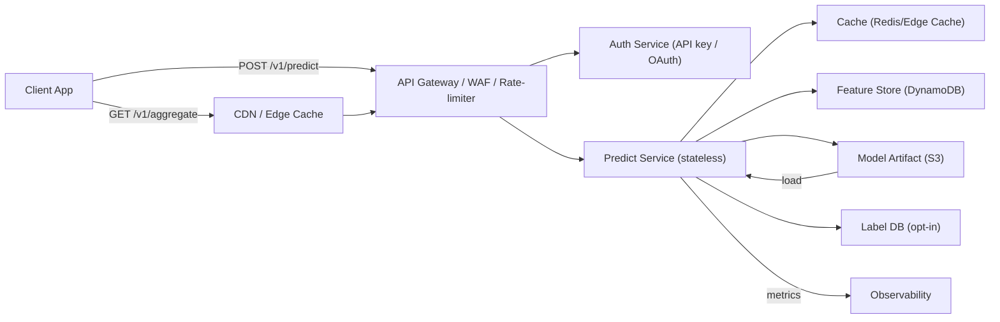

# Architectural Diagram and Minimal Evaluation Plan — *CatchChance*

*(For Minimal Evaluation Plan, please also see Sections 4, 5, and 10 of `Project_Sepc.md` for full detail. This file restates essentials for rubric compliance.)*

---

## Architectural Diagram

## Baseline vs. Model Plan

* **Baseline (defensible, immediate):**
  Hour × grid historical catch rate with Laplace smoothing (α=10), computed over 90 days.
  → Cheap DB query; fits within free-tier.

* **Simple Model (candidate):**
  Logistic regression (or small GBT) predicting `caught_any` with features: user-level catch rate, hour, environment, location grid.
  → Lightweight, interpretable, low-cost inference.

---

## Metrics & SLA

* **Primary metrics:**

  * **AUC-PR** (handles imbalanced positives).
  * **Calibration** (Brier score / calibration curve).

* **Secondary metrics:**

  * p95 latency
  * Error rate
  * Cache hit rate
  * Cost per 10k predictions

* **SLA targets:**

  * p95 latency ≤ **300 ms** for personalized predictions.
  * **99.5% availability** of health endpoints.
  * Cost envelope:

    * Normal load (100 req/day) stays in free tier.
    * Max budget ≤ **\$1 per 10k predictions** at scale.
  * **Graceful degradation** under burst (50k req/hr).

---

## Measurement Plan

* **Offline eval:**

  * Historic session data (hashed user\_id, grid, hour, features, label).
  * Time-based split: train → validation → test to avoid leakage.
  * Compare baseline vs model on AUC-PR and Brier.
  * Acceptance: ≥0.05 AUC-PR gain OR ≥5% Brier improvement.

* **SLA measurement:**

  * Synthetic load tests.
  * Normal load: 100 req/day → confirm cost ≈ \$0.
  * Spike load: 50k req/hr → check cache hit rate, p95 latency, and confirm circuit-breaker degrades safely.
