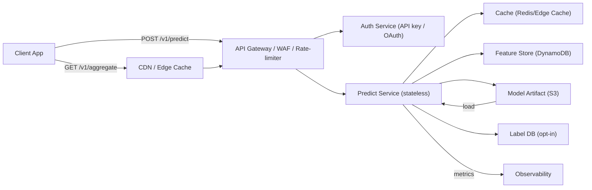

# Project Spec - CatchChance

## 1) User & Decision
**User:**  Recreational anglers using mobile/web app.

**Decision:** When to fish (session/hour) based on probability of catching ≥1 fish.

**Rationale:** Optimizes time on water, manages expectations, reduces frustration. Guardrails needed for privacy (location, behavioral data).

## 2) Target & Horizon
**Target:** Binary `caught_any` (1 if ≥1 catch in session, else 0). The API returns a probability `p ∈ [0,1]` for that target.

**Horizon:** Next fishing session within chosen hour bucket (or current bucket if none provided).

Granularity: hourly or coarse (morning/afternoon/evening/night). No leakage: only features available **pre-session**.

## 3) Features (No leakage)
**At Prediction Time:** `hour_of_day`, `day_of_week`, `month`, coarse `location_grid` (e.g., 1 km²), recent user history (`n_sessions_past_30d`, `catch_rate_past_30d`), and optional environmental data (`water_temp`, `weather_brief`, `tide_state`, `bait_type`, `target_species`).

**Excluded (Avoids Leakage):** Any post-session data for the predicted session, future environmental forecasts, raw GPS traces, or exact timestamps. Aggregated, pseudonymized data is used instead to protect user privacy.

**Notes:** make `location_grid` coarse by default; require opt-in for finer location.

## 4) Baseline → Model Plan
* **Baseline:** Historical catch rate by hour+grid, smoothed with Laplace prior (α=10).

* **Simple Model:**  Logistic regression / small boosted tree.

* **Hypothesis:**  Personalization + environment + time improves calibration & ranking over baseline.

Refer to [Baseline vs Model Plain](https://github.com/Awakuruf/CPSC346C-Solo-Project/blob/main/Minimal_Evaluation_Plan.md#baseline-vs-model-plan) for more details.

## 5) Metrics, SLA, and Cost
* **Primary:** AUC-PR (imbalanced positives) + calibration (Brier).

* **Secondary:** latency (p95), error rate, cache hit rate, cost/10k predictions.

* **SLA:** p95 ≤300 ms; ≥99.5% availability; ≤$1 per 10k predictions.

* **Rationale:** Keeps UX responsive and sustainable on free tier.

Refer to [Metrics & SLA](https://github.com/Awakuruf/CPSC346C-Solo-Project/blob/main/Minimal_Evaluation_Plan.md#metrics--sla) for more details.

## 6) API Sketch

**6.1 Endpoints**

| Method | Path                        | Purpose                 | Auth   |
| ------ | --------------------------- | ----------------------- | ------ |
| POST   | /v1/predict                 | Return probability      | Bearer |
| GET    | /v1/health                  | Liveness check          | none   |
| POST   | /v1/report\_session         | (Opt-in) report outcome | Bearer |
| GET    | /v1/aggregate/\:grid/\:hour | Public aggregate        | none   |

**6.2 Request example (POST /v1/predict)**
```json
{
  "user_id": "user-123",
  "location_grid": "g-53.123_-123.123",
  "hour": 14,
  "bait_type": "worm",
  "target_species": "trout",
}
```
**6.2 Response (200)**
```json
{
  "score": 0.37,
  "bucket": "afternoon",
  "explanation": "based on 30-day catch rate and current water temp",
  "model_version": "v0.3"
}
```
**6.3 Auth scheme:**
* **Auth:** `Authorization: Bearer <API_KEY>`
  • Free-tier → cached aggregates end points only
  • Registered (opt-in) → personalized predictions
  • OAuth reserved for 3rd-party partner integrations

* **Rate limits:**
  • Default:  60 req/min per registered API key.
  • Free-tier: 600 req/min (cache)
  • Spikes: token bucket higher-tier priority + cache graceful degradation

## 7) Privacy, Ethics, Reciprocity (PIA excerpt)

* **Data inventory:** pseudonymous user_id, coarse grid, 30-day aggregates.
* **Purpose limitation:** prediction + model improvement (opt-in). No ads/sale.
* **Retention:** raw 30d → aggregated; aggregates 2y. Opt-out supported.
* **Guardrails:** k-anon (k≥10) for aggregates, Laplace noise, coarse grids default, opt-in for fine GPS.
* **Telemetry:** latency & error logs (low invasiveness, 90–180d TTL). Minimal device info (UA type) for debugging, 7d TTL.
* **Reciprocity:** users get personalized predictions + optional community dashboard.

Refer to [Privacy Impact Assessment (PIA) ](https://github.com/Awakuruf/CPSC346C-Solo-Project/blob/main/Privacy_Impact_Assessment.md) for more details, including the full matrix and guardrails.

## 8) Architectural Diagram


## 9) Risks & Mitigations
1. **Cost spikes:** rate limits + degrade to cache/baseline.
2. **Privacy/re-ID:** coarse grids, k-anon, jitter.
3. **Calibration harm:** track Brier, recalibrate (Platt/isotonic), slow rollouts.

Refer to [Risks & Mitigations](https://github.com/Awakuruf/CPSC346C-Solo-Project/blob/main/Privacy_Impact_Assessment.md#11-risks--mitigations) for details.

## 10) Measurement Plan (minimal experiment)

**Offline:** Train/test split by time; compare baseline vs model on AUC-PR & Brier. Accept ≥0.05 AUC-PR gain or ≥5% Brier improvement.

**SLA tests:** Synthetic load (normal 100 req/day, burst 50k req/hr). Confirm latency & cost within SLA.

Refer to [Measurement Plan](https://github.com/Awakuruf/CPSC346C-Solo-Project/blob/main/Minimal_Evaluation_Plan.md#measurement-plan) for detailed write up.


## 11) Evolution & Evidence
* Complete Git history: [Commit range 28f789b → Current](https://github.com/Awakuruf/CPSC346C-Solo-Project/commits/main/)
* Insight memo: [Insight\_Memo.md](https://github.com/Awakuruf/CPSC346C-Solo-Project/blob/main/Insight_Memo.md)
* Assumption audit: [Assumption\_Audit.md](https://github.com/Awakuruf/CPSC346C-Solo-Project/blob/main/Assumption_Audit.md)
* Socratic log: [Socratic\_Log.md](https://github.com/Awakuruf/CPSC346C-Solo-Project/blob/main/Socratic_Log.md)